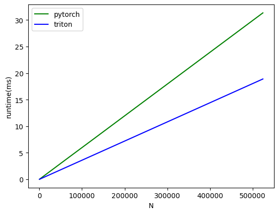

# GEGLU-triton

Triton-implementation of GEGLU

# Installation

```sh
pip install git+https://github.com/Kitsunetic/GEGLU-triton.git
```

# Usage

```py
from geglu_trion import GEGLU, geglu

x = torch.rand(1, 2, 3, 4, 4096, 4096, device="cuda")
y = geglu(x)  # 1, 2, 3, 4, 4096, 2048

# for CPU tensor, it is executed on CPU mode
x = torch.rand(1, 2, 3, 4, 4096, 4096)
y = geglu(x)  # 1, 2, 3, 4, 4096, 2048

# can be used as a nn.Module
x = torch.rand(4096, 4096)
model = GEGLU().cuda()
y = model(x)  # 4096, 2048
```

# Benchmark


